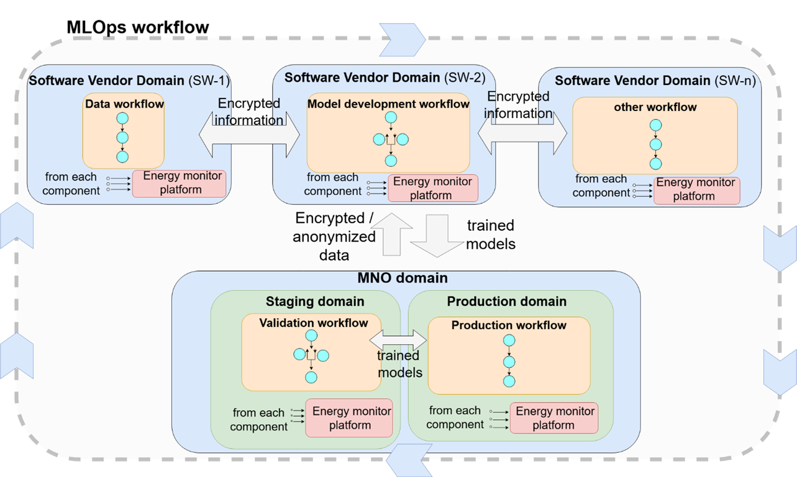
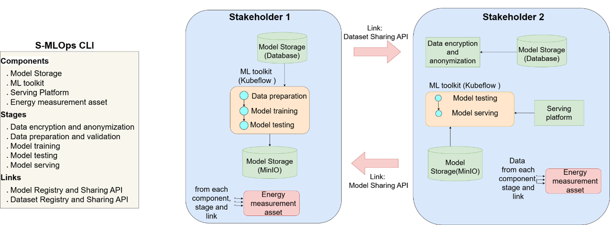
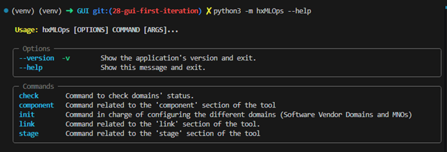

# HX-MLOps

## Table of Contents

<!-- toc -->

- [Overview](#Overview)
- [Technologies Used](#technologies-used)
- [Installation Guide](#installation-guide)
- [User Guide](#user-guide)
<!-- - [Build a MLOps multistakeholder ecosystem](#build-a-mlops-multistakeholder-ecosystem) -->

<!-- tocstop -->


## Overview

The HX-MLOps software is designed to streamline, oversee, and enhance the lifecycle of AI/ML-driven network services, leveraging established DevOps principles for continuous integration and development (CI/CD) of AI/ML models while addressing the multi-stakeholder nature of the telco-grade ecosystem. The 
figure provides an overview of the operational scope of the HX-MLOps system, illustrating how MLOps workflows span multiple domains through modules that securely transfer information:

- Software providers develop AI/ML-based network services, dividing tasks such as processing MNO data and generating ML models.
- The mobile network operator (MNO) receives trained models, validating them in a staging environment before deploying them to production.
- The S-MLOps system enables independent workflow creation for each domain, managing inter-module communication and energy measurement at each stage.

<p align="center">
  
</p>
<p align="center"><em>Figure 1: Overview of the operational scope of the S-MLOps system.</em></p>


It features a Python-based command-line interface (CLI) that allows users—e.g Software Vendors, network operators, etc—to customize and deploy AI/ML workflows tailored to their specific needs. The HX-MLOps platform supports modular deployments through a categorized approach to components, including storage solutions, ML lifecycle management modules, serving platforms, observability tools, and energy measurement resources. It also offers APIs for sharing models and datasets among the diverse stakeholders involved in developing and/or utilizing AI/ML models, fostering enhanced collaboration and integration across the ecosystem.


The CLI enables the deployment of various modules, organized into three main categories based on their functionality: Components, Stages, and Links. A visual representation of the types of modules included in the HX-MLOps can be found in the figure 2. These modules are outlined below:

### Components 

Components refer to advanced frameworks, mainly open-source, designed to address specific tasks within particular domains. These frameworks are essential for improving the performance and scalability of MLOps workflows. The CLI includes the following components:

- Storage: Tools for managing data storage in workflows. Examples include databases such as TimescaleDB and PostgreSQL, as well as MinIO and time-series databases like Prometheus, which are used for tracking sustainability metrics.
    - ML Toolkits: Platforms that support the entire lifecycle of ML/AI models, covering tasks such as data preparation, model training, experimentation, versioning, and deployment. The CLI offers commands for deploying Kubeflow.

    - Serving Platforms: Frameworks designed for deploying and managing ML/AI models in production. The CLI includes commands for setting up TorchServe and TensorFlow Serving, which are tailored for serving PyTorch and TensorFlow models, respectively.

    - Energy Measurement Tools: Modules for monitoring energy usage, such as Kepler and Scaphandre. Plans are underway to expand this catalog, including tools for tracking carbon intensity based on location and grouping sustainability metrics by workflow stages. These features enable the assessment of environmental impact as part of the workflow analysis.

    - Observability: Tools for monitoring and visualization, such as Grafana, which provides insights into the evolution of sustainability metrics in multi-stakeholder environments.

### Stages

This category includes modules that offer specific capabilities for different phases of ML/AI model development. Examples include tools for data encryption and anonymization to ensure data privacy in multi-stakeholder workflows, as well as modules for data validation, model training, and testing. Future updates aim to include modules specifically designed for AI/ML-based network service development.

### Links

Links: These modules facilitate the exchange of data, such as datasets or trained models, across different domains (e.g., between software vendors and network operators). They also handle data sharing between components and stages. The CLI supports two Open APIs:

- The Model Sharing API, which acts as a registry for storing and sharing trained ML models across domains.
- The Dataset Sharing API, which is designed to store, share, and manage datasets created for training ML/AI models.


<p align="center">
  
</p>
<p align="center"><em>Figure 2: Visual representation of the types of modules included in the HX-MLOps CLI.</em></p>


## Technologies Used

HX-MLOps integrates multiple cutting-edge technologies to enable efficient MLOps workflows. The key technologies used in this system include:

### **1. Programming Languages & Frameworks**
- **Python 3.12.3** – Primary language for CLI development.
- **FastAPI** – Used for building APIs with high performance.
- **PyTorch & TensorFlow** – Supported frameworks for training and serving ML models.

### **2. ML Lifecycle Management**
- **Kubeflow** – Orchestrates ML pipelines and experiments.
- **TorchServe & TensorFlow Serving** – Model serving solutions.

### **3. Data Storage & Databases**
- **TimescaleDB & PostgreSQL** – Used for storing structured data.
- **MinIO** – Object storage for datasets and artifacts.

### **4. Observability & Monitoring**
- **Grafana** – Visualizes performance and sustainability metrics.
- **Kepler & Scaphandre** – Tools for energy consumption tracking.

### **5. Infrastructure & Deployment**
- **Kubernetes** – Manages containerized workloads.
- **Helm** – Deploys Kubernetes applications.
- **Docker** – Packages and distributes applications in containers.

These technologies work together to provide a scalable, modular, and efficient MLOps environment tailored to telecom and AI-driven network services.


## Installation Guide

### 1️⃣ Set Up a Kubernetes Cluster using kind (for local testing)

HX-MLOps is a command-line interface (CLI) designed to deploy and manage MLOps components on **Kubernetes clusters**. Therefore, before installing HX-MLOps, you must have a running **Kubernetes cluster** accessible from your machine.  

If you don't have a Kubernetes cluster, you can set one up using [kind](https://kind.sigs.k8s.io/):

```sh
# Install kind if not already installed
curl -Lo ./kind https://kind.sigs.k8s.io/dl/v0.20.0/kind-linux-amd64
chmod +x ./kind
sudo mv ./kind /usr/local/bin/

# There are 3 main predefined clusters in the folder work_environments/kind/telco_simulation:
# 1. mno-production.yaml
# 2. mno-staging.yaml
# 3. software-vendor
# You can create a cluster with the following command:
kind create cluster --config {file_name} (software-vendor.yaml, mno-staging.yaml or mno-production.yaml)
```

### 2️⃣ Set up a local python environment:

This project is build over Python 3.12.3. You need to have this python version installed in your computer. Execute the following command to build an environment:

```sh
    python  -m venv ./venv (or python3 -m venv ./venv) 
    source venv/bin/activate
    # (venv) $ --> here your python environment is ready
    # Install the project dependencies with the following commmand:
    pip install -r requirements.txt
```

### 3️⃣ Verification:

After installing the dependencies, verify that it is possible to run the CLI without problems. Run the following command in your terminal:

```sh
    # activate the python environment previously created
    source venv/bin/activate
    # execute the CLI with the following command:
    python3 -m hxMLOps --help
```

The previous command output must be the code that is shown in the figure 3.

<p align="center">
  
</p>
<p align="center"><em>Figure 3: Screenshot of the S-MLOps CLI.</em></p>


## User Guide

### List of Options

The following are the options that the CLI provides.

#### 1️⃣ Help

You can add `--help` at the end of each command to get information about it. The following are examples of how to retrieve help for specific commands:

```sh
    # Get general help
    python -m hxMLOps --help
    # Get information about a specific command (check)
    python -m hxMLOps check --help
```

#### 2️⃣ Version

To check the CLI version, use the following command:

```sh
    python -m hxMLOps --version
```

### List of Commands

The following are the commands that the CLI supports.

#### 1️⃣ init

This command groups three subcommands:

- **new_config**: Allows the user to link the CLI with the domain (Kubernetes cluster) where the MLOps workflow will be configured. This is an interactive command that enables the configuration of up to three domains simultaneously. It internally checks the domains configured in the `.kubeconfig` file, so this file must be accessible to the CLI.
- **set_default_domain**: Since the previous command allows users to configure up to three domains, this command lets the user select the default domain.
- **show_config**: Displays the current configuration.

```sh
    python -m hxMLOps init new_config 
    python -m hxMLOps init set_default_domain 
    python -m hxMLOps init show_config 
```

#### 2️⃣ check

This command verifies the connection between the CLI and each previously configured domain.

```sh
    python -m hxMLOps check connection
```

The command returns whether the connection is successful or not.

#### 3️⃣ component, link, and stage commands

The `component`, `link`, and `stage` commands allow interaction with the different modules integrated into the tool. Each command provides a set of subcommands to perform specific actions related to MLOps workflows:

- **create**: Deploys the module given as a parameter.
- **delete**: Deletes the module given as a parameter.
- **info**: Displays information regarding the asset name given as a parameter. Both general asset information and the configuration file to be filled in are displayed.
- **status**: Shows the status of an asset given as a parameter.

To apply any of these actions, you must specify the group to which the module belongs and the specific module name.

For components, the available groups are:

- `energy_measurement_asset`: Scaphandre and prometheus.
- `ml_toolkit`: kubeflowPipeline
- `monitoring`: grafana
- `serving_platform`: torchserve an tfserving
- `storage`: postgres, minio, pgadmin, timescale

For links, the available groups are:

- `api`: datasetsharing and modelsharing.

You can list the available groups using:

```sh
    python3 -m mlopsTool {type of module e.g component} --help
```

You can list the modules using:

```sh
    python3 -m mlopsTool {type of module e.g component} {action e.g create} --help
```

 ### Using Helm Charts for Module Configuration

To apply an action to a module, you need to provide the "values" file from the Helm chart of the component. If no file is provided, the default configuration will be applied. The argument is the following:

```sh
    python3 -m mlopsTool component storage create pgadmin --file {file_path}
```

You can list the available "values" files for each component using the following command:

```sh
    python3 -m mlopsTool component list-values
```

This allows you to understand the specific configuration of each module before applying an action.


<!-- ## Build a MLOps multistakeholder ecosystem -->


